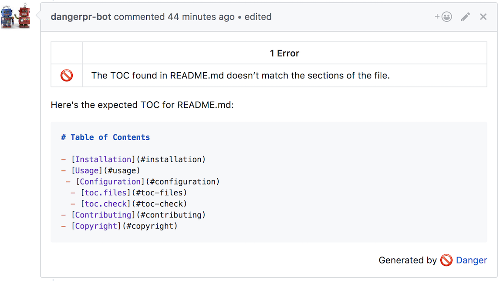

# danger-toc

A plugin for [danger.systems](http://danger.systems) that makes sure your project’s `README.md` has a TOC.

[](https://badge.fury.io/rb/danger-toc)
[](https://travis-ci.org/dblock/danger-toc)

## Table of Contents

- [Installation](#installation)
- [Usage](#usage)
 - [Configuration](#configuration)
  - [toc.files](#toc-files)
  - [toc.check](#toc-check)
- [Contributing](#contributing)
- [Copyright](#copyright)

## Installation

Add `danger-toc` to your Gemfile.

```
gem 'danger-toc', '~> 0.1'
```

Add `toc.check` to your Dangerfile. Make a pull request and see this plugin in action.



## Usage

Methods and attributes from this plugin are available in your `Dangerfile` under the `toc` namespace.

### Configuration

The plugin supports following configuration options:

You can configure plugin using following code:
```ruby
Danger::Toc.configure do |config|
  config.files = [ 'README.md' ]
end
```

#### toc.files

List of files to ensure TOC in.

#### toc.check

Run all checks with defaults.

## Contributing

See [CONTRIBUTING](CONTRIBUTING.md).

## Copyright

Copyright (c) Daniel Doubrovkine, 2017

MIT License, see [LICENSE](LICENSE.txt) for details.
